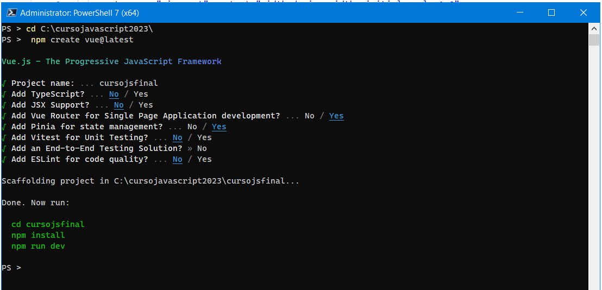
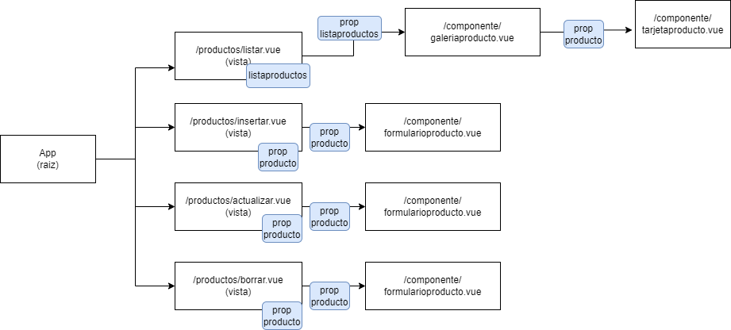

# cursojsfinal

1. Crear el proyecto de Vue



2. Una vez creado, abrirlo con visual studio code.

3. En visual Studio Code, abrir el terminal y ejecutar los siguientes comandos

```bash
nmp i axios
```

4. Una vez instalado, en el terminal, ejecutar vue

```bash
npm run dev
```

5. En Postman (o alguna herramienta para probar web service), probar

* https://seg.cl/api/laravel/public/api/imagenlacteo  (GET)
    Un listado con imagenes de productos lacteos
* https://seg.cl/api/laravel/public/api/productolacteo (GET)    
    Un listado con los productos lacteos.
* https://seg.cl/api/laravel/public/api/categorialacteo  (GET)
    Un listado con imagenes de productos lacteos

6. Bootstrap 5

En el terminal

```bash
npm install --save bootstrap
npm install --save @popperjs/core
```

Y modifico main.js para agregar bootstrap

```js
import "bootstrap/dist/css/bootstrap.min.css"
import "bootstrap"
```

7. Limpieza del codigo.

Borro las carpetas /src/assets, /src/components

8. Y voy a revisar que App.vue, y alguna vista no ocupe esos componentes


9. Crear la primera vista

En la carpeta views, vamos a crear una carpeta producto. Dentro de ella vamos a crear un componente llamado ListarView.vue

10. Crear una ruta a esa vista

Ir a la carpeta /src/router y editar index.js para agregar la ruta y vinculararla a la vista


11. Crear javascript para conectarse al web service

/src/ws/productolacteows.js

```js
import axios from 'axios';
export default {
    listar:() => {
        return axios.request({
            method: 'get',
            maxBodyLength: Infinity,
            url: 'https://seg.cl/api/laravel/public/api/productolacteo',
            headers: { }
          });
    }
}
```


12. Usar el javascript en el componente deseado (en la vista de productos)

```js
    import productolacteows from '../../ws/productolacteows.js';
    // ref, reactivo
    let listado=ref([]);
    productolacteows.listar()
        .then((resultado)=>listado.value=resultado.data)
        .catch((error)=>console.log(error));
```

13. Si es necesario, enviar datos entre componentes como propiedades

En el componente padre
```html
    <galeriaproducto :listado="listado" />
```
En el componente hijo    

```js
    const props = defineProps(['listado']);
```


14. Diagrama



